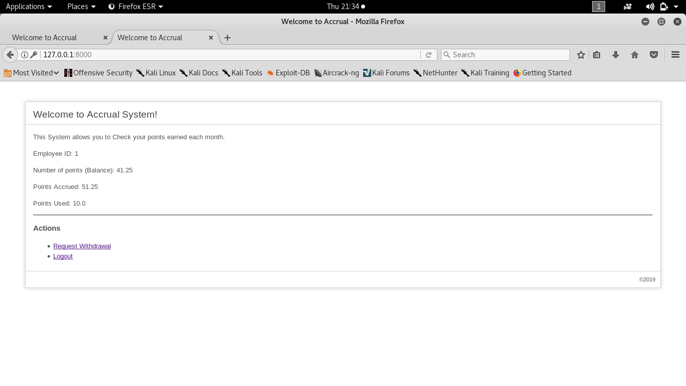

# Accrual System for employees
This application is developed using django framework version 2.2.2

## How it works

* Run Script add_cron_job.sh to enable monthly update in cron table (done for linux).
* If not logged in, the user will be redirected to login page
* For monthly update, a custom django command is used
```bash
$ python3 manage.py monthly_increment
```


### Note:
* A user is able to see the points info (used accrued and balance) when logged in.
* On this page, the user can logout and also be able to request withdrawal of points
* For all users, default password is: 1234
## Sample
